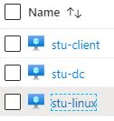

# Applied Purple Teaming Threat Optics Lab - Azure Terraform 
Purple Teaming Attack &amp; Hunt Lab - Terraform

<!-- Table of Contents -->
* [Applied Purple Teaming Threat Optics Lab - Azure Terraform](#applied-purple-teaming-threat-optics-lab---azure-terraform)
  * [Background](#background)
  * [Installation](#installation)
    * [Install Azure CLI](#install-azure-cli)
    * [Install Terraform](#install-terraform)
* [Setup and Configuration](#setup-and-configuration)
  * [Create Token/Document](#create-tokendocument)
  * [Default Credentials:](#default-credentials)
    * [Changing Default Credentials](#changing-default-credentials)
  * [Configure Regions](#configure-regions)
  * [Clone APT Terraform Repository](#clone-apt-terraform-repository)
  * [Execute Terraform build process](#execute-terraform-build-process)
  * [Source IP Filtering](#source-ip-filtering)
  * [Successful Deployment](#successful-deployment)
  * [Troubleshooting Steps](#troubleshooting-steps)
* [Destroying the Lab](#destroying-the-lab)
  * [Accessing HELK:](#accessing-helk)
* [Modules](#modules)
    * [Network](#network)
    * [Active Directory](#active-directory)
    * [Linux / HELK](#linux--helk)
    * [Windows Client](#windows-client)
* [Hat-Tips and Acknowledgments](#hat-tips-and-acknowledgments)

---

## Background
Defensive Origins uses a highly verbose threat optics lab to isolate adversarial techniques to more easily attribute IOC (indicators of compromise).  These labs have routinely been time consuming to build and manage.  The platform included here automates much of the threat-optic lab environment built on the Azure cloud network.

## Installation
This process requires Python 3.

### [Install Azure CLI](https://docs.microsoft.com/en-us/cli/azure/install-azure-cli-apt?view=azure-cli-latest)

### [Install Terraform](https://learn.hashicorp.com/terraform/getting-started/install.html)

# Setup and Configuration

## Create Token/Document
* From the [Azure Terraform Provider](https://registry.terraform.io/providers/hashicorp/azurerm/latest/docs/guides/service_principal_client_secret.html#creating-a-service-principal-using-the-azure-cli):
    ```bash
    # login
    az login

    # list accounts
    az account list

    # set subscription
    az account set --subscription="<subscription_id>"

    # create service principal
    az ad sp create-for-rbac --role="Contributor" --scopes="/subscriptions/<subscription_id>" 
    ```
    > This command will output 5 values:
    ```json
    {
        "appId": "00000000-0000-0000-0000-000000000000",
        "displayName": "azure-cli-2017-06-05-10-41-15",
        "name": "http://azure-cli-2017-06-05-10-41-15",
        "password": "0000-0000-0000-0000-000000000000",
        "tenant": "00000000-0000-0000-0000-000000000000"
    }
    ```
    > These values map to the Terraform variables like so:
    >
    > * `appId` is the `client_id` defined above.
    > * `password` is the `client_secret` defined above.
    > * `tenant` is the `tenant_id` defined above.
    >  
* Copy `.env.example` to `.env`
* Edit `.env` and add your token info

## Default Credentials:
Default credentials are set in main.py.
* Windows & Linux systems:
```bash
itadmin:APTClass!
```
* Kibana:
```bash 
helk:hunting
```

### Changing Default Credentials
The credentials can be changed within the locals variable:
``` bash  
locals {
  resource_group_name   = "class-resources"
  master_admin_username = "itadmin"
  master_admin_password = "APTClass!"
  master_domain         = "labs.local"
}
```

The password for Kibana can be changed by editing the HELK install line:
```bash
./helk_install.sh -p hunting -i 10.10.98.20 -b 'helk-kibana-analysis-alert'
```
within `./apt_lab_tf/master/modules/linux/3-setup.tf`


Please note the following regarding access:
* Only the Windows client is accessible externally
* Kibana is accessed internally, use a browser on one of the Windows machines to access.
* An SSH client will need to be installed on the Windows machines in order to SSH to the Linux system.

## Configure Regions
* You can also update the Region variable to desired region. This is updated main.py.
* List of regions can be found here that offer the B-series we use in this lab environment.
* https://azure.microsoft.com/en-us/global-infrastructure/services/?products=virtual-machines

## Clone APT Terraform Repository

```bash
git clone https://github.com/pythoninthegrass/apt_lab_tf
cd apt_lab_tf
```

## Execute Terraform build process
Run the builder and deploy your systems.

```bash
python main.py -m <PUBLIC_IP>
```
Please note:
* If this script errors, or there are missing dependencies ensure it is being executed with Python 3.X. As such, attempt to execute with Python3 directly:
```bash
python3 main.py -m <PUBLIC_IP>
``` 

## Source IP Filtering
The `-m` flag will accept a single IP Address or Subnet as input. This adds the IP as a SRC IP address filter on the lab environment. 
```bash
-m [IP]
```

## Successful Deployment
To confirm successful deployment the following 3 virtual machines will be found within Azure:
* stu-client
* stu-dc
* stu-linux

    

Deployment, include all the post-installation scripts, may take twenty minutes or more. Setup of the Linux node, with its ELK stack, will take the longest.

## Troubleshooting Steps
If `main.py` errors during execution. Delete the labs folder, found at `./apt_lab_tf/labs/`.

 The error (shown at the top of script execution) is:
 ```bash
 Directory not copied. Error: [Errno 17] File exists: './labs'.
 ```

Errors referencing a 'duplicate' are also solved by this. Examples include:
```bash
Error: Duplicate module call
Error: Duplicate resource "azurerm_resource_group" configuration
```

If main.py gives you an error as follows:
```bash
TypeError: replace() argument 2 must be str, not tuple
```

... it means that you copy-pasted configuration data for your Azure Cloud authentication, without removing the trailing comma (,). Definitions such as "client_id" should not end with a comma.


If main.py creates only one or two out of the three VMs it will likely also throw an error including the following text:
```
Operation could not be completed as it results in exceeding approved Total Regional Cores quota.
```

This occurs when you have a free/trial Azure Cloud subscription, which is limited to 4 active CPU cores. You may edit the VM definitions for the Active Directory server and the Windows client, to change the VM sizing. This is done in the files named "2-virtual-machine.tf", by replacing the "vm_size" field. The files include an example line to use as replacement. 

# Destroying the Lab
```bash
python main.py -destroy
```

**CAUTION**: All data within the VMs will be deleted.
The `-d` or `-destroy` flag will execute the `terraform destroy` command. This will remove the Lab in Azure. 

Please confirm within the Azure portal that everything has been deleted.

## Accessing HELK:

<!-- TODO -->

--- 

# Modules
The various components of this build process are defined below.

| Module          | Function                                 |
|-----------------|------------------------------------------|
| /master/modules | Various Terraform modules                |
| main.py         | Python script that uses Terraform and AzureCLI to build the Applied Purple Teaming to specifications using the modules in /master/modules and additional resources. |
| scripts         | Additional resources to configure lab environment. |

### Network
This module creates a Network with 2 x Subnets:
* Domain Controllers
* Domain Clients

This module shouldn't be used as-is in a Production Environment - where you'd probably have Network Security Rules configured - it's designed to be a simplified configuration for the purposes of this example.

| Module       | Function                |
|--------------|-------------------------|
| main.tf      | Setup Primary Network   |
| outputs.tf   | Grab and Set Network ID |
| variables.tf | Terraform variables     |

### Active Directory
* This module is designed to quickly spin up an Active Directory Forest on a single node, this is by no means best practice and we'd highly recommend not using this approach in Production.
* This module was based on / heavily inspired by: https://github.com/bobalob/Terraform-AzureRM-Example/tree/winrm-https

| Module                            | Function                                 |
|-----------------------------------|------------------------------------------|
| 1-network-interface.tf            | Setup interface of Domain Controller     |
| 2-virtual-machine.tf              | Specify Domain Controller VM Attributes  |
| 3-provision-domain.tf             | Initial Domain Configuration              |
| 4-wait-for-domain-to-provision.tf | Quietly wait for Domain to finish provisioning |
| 5-setup.tf                        | Domain Controller Services and Software Configuration |
| variables.tf                      | Terraform variables                      |
| files/FirstLogonCommands.xml      | Run first commands                         |
| files/winrm.ps1                   | Enable WinRM, grab Lab resources          |

### Linux / HELK 
* This module configures a Ubuntu image with the necessary tooling to be used as a hunters-SIEM (HELK)

| Module                 | Function                                 |
|------------------------|------------------------------------------|
| 1-network-interface.tf | Setup interface for Linux system         |
| 2-virtual-machine.tf   | Specify VM configuration for Linux System |
| 3-setup.tf             | Setup and configure software              |
| variables.tf           | Terraform variables                      |

### Windows Client
* This module provisions a Windows Client which will be bound to the Active Directory Domain created in the other module.
* There's a few hacks in here as we have to wait for Active Directory to become available, but this takes advantage of the **azurerm_virtual_machine_extension** resource. It's worth noting that the keys in this resource are case sensitive.

| Module                            | Function                                 |
|-----------------------------------|------------------------------------------|
| 1-network-interface.tf            | Setup network interface for Windows client |
| 2-virtual-machine.tf              | Specify client VM configuration           |
| 3-wait-for-domain-to-provision.tf | Politely wait for the Domain to be provisioned |
| 4-join-domain.tf                  | Join Windows client to domain.           |
| 5-setup.tf                        | Procure and configure the various tools.  |
| outputs.tf                        | Grab the associated VM IP.               |
| variables.tf                      | Terraform variables                      |

# Hat-Tips and Acknowledgments
* https://github.com/bobalob/Terraform-AzureRM-Example/tree/winrm-https 
  * Gave us a head start on setting up the necessary configuration to use WinRM for deployment.
